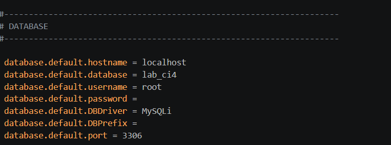
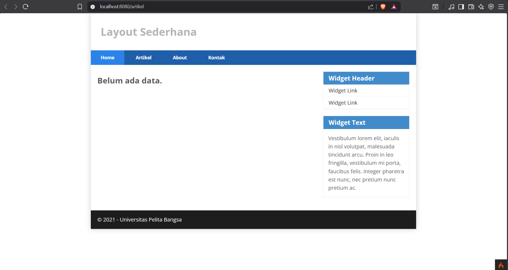
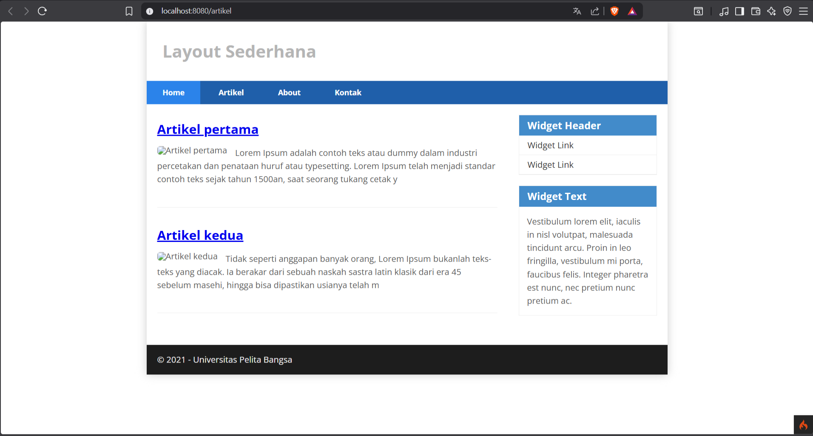
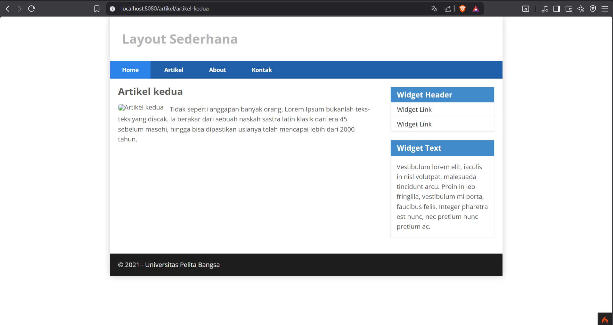
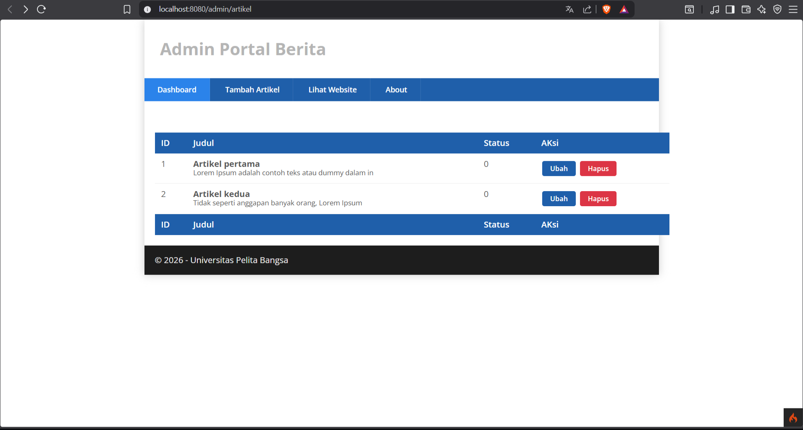
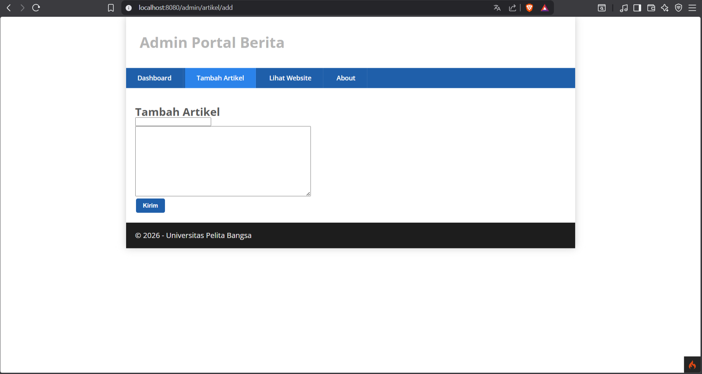
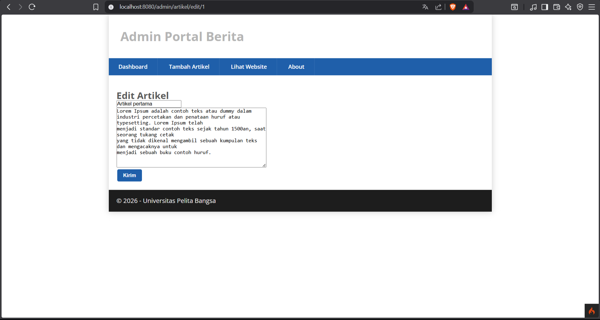

# Praktikum 2: Framework Lanjutan (CRUD)

## Nama: Albhani Fadillah Haryady
## NIM: 312410130
## Kelas: I241A

## Langkah-langkah Praktikum


## Membuat Database
```
CREATE DATABASE lab_ci4;
```
## Membuat Tabel
```
CREATE TABLE artikel (
 id INT(11) auto_increment,
 judul VARCHAR(200) NOT NULL,
 isi TEXT,
 gambar VARCHAR(200),
 status TINYINT(1) DEFAULT 0,
 slug VARCHAR(200),
 PRIMARY KEY(id)
);
```
## Konfigurasi koneksi database
Selanjutnya membuat konfigurasi untuk menghubungkan dengan database server. Konfigurasi
dapat dilakukan dengan du acara, yaitu pada file app/config/database.php atau menggunakan
file .env. Pada praktikum ini kita gunakan konfigurasi pada file .env. 


## Membuat Model
Selanjutnya adalah membuat Model untuk memproses data Artikel. Buat file baru pada
direktori app/Models dengan nama ArtikelModel.php
```php
<?php

namespace App\Models;

use CodeIgniter\Model;

class ArtikelModel extends Model
{
    protected $table = 'artikel';
    protected $primaryKey = 'id';
    protected $useAutoIncrement = true;
    protected $allowedFields = ['judul', 'isi', 'status', 'slug', 'gambar'];
}
```
## Membuat Controller
Buat Controller baru dengan nama Artikel.php pada direktori app/Controllers.
```php
<?php

namespace App\Controllers;

use App\Models\ArtikelModel;

class Artikel extends BaseController
{
    public function index()
    {
        $title = 'Daftar Artikel';
        $model = new ArtikelModel();
        $artikel = $model->findAll();
        return view('artikel/index', compact('artikel', 'title'));
    }
}
```
## Membuat View
Buat direktori baru dengan nama artikel pada direktori app/views, kemudian buat file baru
dengan nama index.php.
```php
<?= $this->include('template/header'); ?>

<?php if($artikel): foreach($artikel as $row): ?>
<article class="entry">
    <h2>
        <a href="<?= base_url('/artikel/' . $row['slug']); ?>"><?= $row['judul']; ?></a>
    </h2>
    " alt="<?= $row['judul']; ?>">
    <p><?= substr($row['isi'], 0, 200); ?></p>
</article>
<hr class="divider" />
<?php endforeach; else: ?>
<article class="entry">
    <h2>Belum ada data.</h2>
</article>
<?php endif; ?>

<?= $this->include('template/footer'); ?>
```
Selanjutnya buka browser kembali, dengan mengakses url 
```
http://localhost:8080/artikel
```

Belum ada data yang diampilkan. Kemudian coba tambahkan beberapa data pada database agar
dapat ditampilkan datanya.
```
INSERT INTO artikel (judul, isi, slug) VALUES 
('Artikel pertama', 'Lorem Ipsum adalah contoh teks atau dummy dalam industri percetakan dan penataan huruf atau typesetting. Lorem Ipsum telah menjadi standar contoh teks sejak tahun 1500an, saat seorang tukang cetak yang tidak dikenal mengambil sebuah kumpulan teks dan mengacaknya untuk menjadi sebuah buku contoh huruf.', 'artikel-pertama'),

('Artikel kedua', 'Tidak seperti anggapan banyak orang, Lorem Ipsum bukanlah teks-teks yang diacak. Ia berakar dari sebuah naskah sastra latin klasik dari era 45 sebelum masehi, hingga bisa dipastikan usianya telah mencapai lebih dari 2000 tahun.', 'artikel-kedua');
```
Refresh kembali browser, sehingga akan ditampilkan hasilnya


## Membuat Tampilan Detail Artikel
Tampilan pada saat judul berita di klik maka akan diarahkan ke halaman yang berbeda.
Tambahkan fungsi baru pada Controller Artikel dengan nama view().
```php
public function view($slug)
{
    $model = new ArtikelModel();
    $artikel = $model->where([
        'slug' => $slug
    ])->first();

    // Menampilkan error apabila data tidak ada.
    if (!$artikel)
    {
        throw PageNotFoundException::forPageNotFoundException();
    }

    $title = $artikel['judul'];
    return view('artikel/detail', compact('artikel', 'title'));
}
```
## Membuat View Detail
Buat view baru untuk halaman detail dengan nama app/views/artikel/detail.php
```php
<?= $this->include('template/header'); ?>

<article class="entry">
    <h2><?= $artikel['judul']; ?></h2>
    " alt="<?= $artikel['judul']; ?>">
    <p><?= $artikel['isi']; ?></p>
</article>

<?= $this->include('template/footer'); ?>
```
## Membuat Routing untuk artikel detail
Buka Kembali file app/config/Routes.php, kemudian tambahkan routing untuk artikel detail.
```php
$routes->get('/artikel/(:any)', 'Artikel::view/$1');
```


## Membuat Menu Admin
Menu admin adalah untuk proses CRUD data artikel. Buat method baru pada Controller
Artikel dengan nama admin_index(). 
```php
public function admin_index()
{
    $title = 'Daftar Artikel';
    $model = new ArtikelModel();
    $artikel = $model->findAll();
    return view('artikel/admin_index', compact('artikel', 'title'));
}
```
Selanjutnya buat view untuk tampilan admin dengan nama admin_index.php
```php
<?= $this->include('template/admin_header'); ?>

<table class="table">
    <thead>
        <th>ID</th>
        <th>Judul</th>
        <th>Status</th>
        <th>Aksi</th>
    </thead>
    <tbody>
        <?php if($artikel): foreach($artikel as $row): ?>
        <tr>
            <td><?= $row['id']; ?></td>
            <td>
                <b><?= $row['judul']; ?></b>
                <p><small><?= substr($row['isi'], 0, 50); ?></small></p>
            </td>
            <td><?= $row['status']; ?></td>
            <td>
                <a class="btn" href="<?= base_url('/admin/artikel/edit/' . $row['id']); ?>">Ubah</a>
                <a class="btn btn-danger" onclick="return confirm('Yakin menghapus data');" href="<?= base_url('/admin/artikel/delete/' . $row['id']); ?>">Hapus</a>
            </td>
        </tr>
        <?php endforeach; else: ?>
        <tr>
            <td colspan="4">Belum ada data</td>
        </tr>
        <?php endif; ?>
    </tbody>
</table>

<?= $this->include('template/admin_footer'); ?>
```
Tambahkan routing untuk menu admin seperti berikut:
```
$routes->group('admin', function($routes) {
$routes->get('artikel', 'Artikel::admin_index');
$routes->add('artikel/add', 'Artikel::add');
$routes->add('artikel/edit/(:any)', 'Artikel::edit/$1');
$routes->get('artikel/delete/(:any)', 'Artikel::delete/$1');
});
```
Akses menu admin dengan url 
```
http://localhost:8080/admin/artikel
```


## Menambah Data Artikel
Tambahkan fungsi/method baru pada Controller Artikel dengan nama add().
```php
public function add()
{
    // validasi data
    $validation = \Config\Services::validation();
    $validation->setRules(['judul' => 'required']);
    $isDataValid = $validation->withRequest($this->request)->run();

    if ($isDataValid)
    {
        $artikel = new ArtikelModel();
        $artikel->insert([
            'judul' => $this->request->getPost('judul'),
            'isi' => $this->request->getPost('isi'),
            'slug' => url_title($this->request->getPost('judul')),
        ]);
        return redirect('admin/artikel');
    }

    $title = "Tambah Artikel";
    return view('artikel/form_add', compact('title'));
}
```
Kemudian buat view untuk form tambah dengan nama form_add.php
```php
<?= $this->include('template/admin_header'); ?>

<h2><?= $title; ?></h2>

<form action="" method="post">
    <p>
        <label>Judul</label><br>
        <input type="text" name="judul" size="50">
    </p>
    <p>
        <label>Isi Artikel</label><br>
        <textarea name="isi" cols="50" rows="10"></textarea>
    </p>
    <p>
        <input type="submit" value="Kirim" class="btn btn-large">
    </p>
</form>

<?= $this->include('template/admin_footer'); ?>
```


## Mengubah Data
Tambahkan fungsi/method baru pada Controller Artikel dengan nama edit()
```php
public function edit($id)
{
    $artikel = new ArtikelModel();

    // validasi data
    $validation = \Config\Services::validation();
    $validation->setRules(['judul' => 'required']);
    $isDataValid = $validation->withRequest($this->request)->run();

    if ($isDataValid)
    {
        $artikel->update($id, [
            'judul' => $this->request->getPost('judul'),
            'isi' => $this->request->getPost('isi'),
        ]);
        return redirect('admin/artikel');
    }

    // ambil data lama
    $data = $artikel->where('id', $id)->first();
    $title = "Edit Artikel";
    return view('artikel/form_edit', compact('title', 'data'));
}
```
Kemudian buat view untuk form tambah dengan nama form_edit.php
```php
<?= $this->include('template/admin_header'); ?>

<h2><?= $title; ?></h2>

<form action="" method="post">
    <p>
        <label>Judul</label><br>
        <input type="text" name="judul" value="<?= $data['judul']; ?>" size="50">
    </p>
    <p>
        <label>Isi Artikel</label><br>
        <textarea name="isi" cols="50" rows="10"><?= $data['isi']; ?></textarea>
    </p>
    <p>
        <input type="submit" value="Kirim" class="btn btn-large">
    </p>
</form>

<?= $this->include('template/admin_footer'); ?>
```


## Menghapus Data
Tambahkan fungsi/method baru pada Controller Artikel dengan nama delete().
```
public function delete($id)
{
    $artikel = new ArtikelModel();
    $artikel->delete($id);
    return redirect('admin/artikel');
}
```